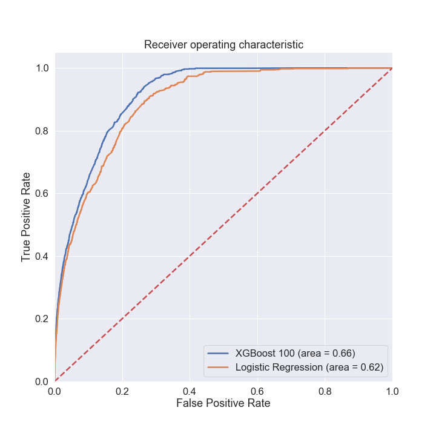

# WidgetCo

Sample analysis on a email marketing campaign dataset

HTML & Python Notebooks show code for:
 - Data Cleaning, EDA 
 - train XGboost and Logistic Regression Models
 - CV and model tuning
 - ROC plot, Confusion matrix, Feature Importance, CV. 
 

 

 
 
